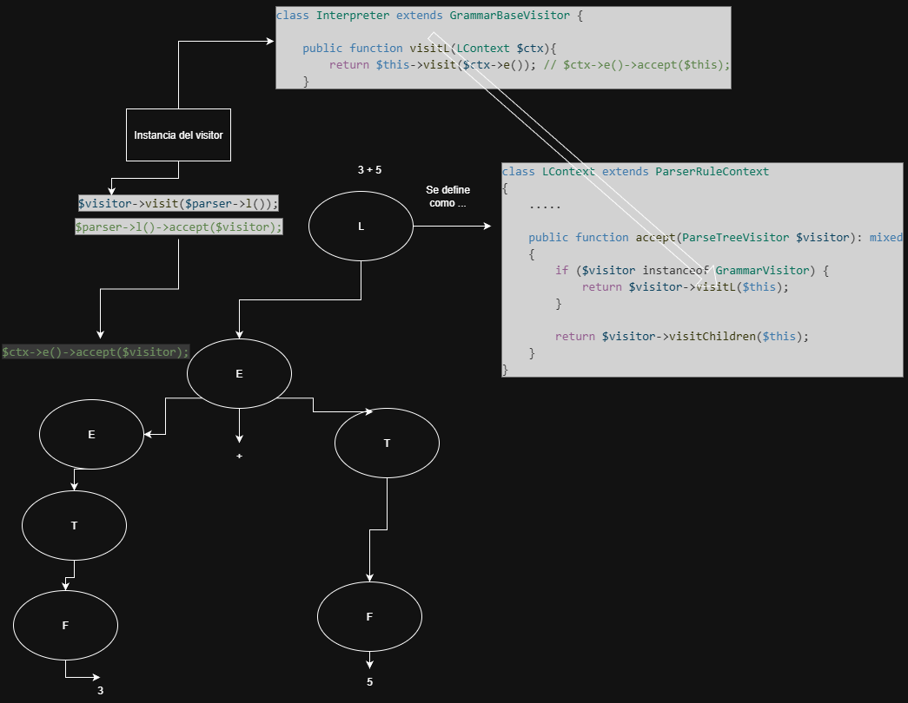

# Comparativa en las clases

Archivo GrammarParser.php
~~~php
class LContext extends ParserRuleContext
{
	.....

	public function accept(ParseTreeVisitor $visitor): mixed
	{
		if ($visitor instanceof GrammarVisitor) {
			return $visitor->visitL($this);
		}

		return $visitor->visitChildren($this);
	}
} 
~~~

~~~java
// Cada clase de elemento concreto debe implementar el método
// `accept` de tal manera que invoque el método del visitante
// que corresponde a la clase del elemento.
class Dot implements Shape is
    // ...

    // Observa que invocamos `visitDot`, que coincide con el
    // nombre de la clase actual. De esta forma, hacemos saber
    // al visitante la clase del elemento con el que trabaja.
    method accept(v: Visitor) is
        v.visitDot(this)
~~~

ANTLR4 ya se encarga de agregar el metodo de accept en las clases que son los nodos del árbol.

# Nuestra implementación del visitor de antrl4
~~~php
class Interpreter extends GrammarBaseVisitor {
    
    public function visitL(LContext $ctx){
        return $this->visit($ctx->e()); // $ctx->e()->accept($this);
    }

    public function visitAdd(AddContext $ctx){
        $left = $this->visit($ctx->e()); // $left = $ctx->e()->accept($this);
        $right = $this->visit($ctx->t());
        return $left + $right;
    }

    public function visitProduct(ProductContext $ctx){
        $left = $this->visit($ctx->t());
        $right = $this->visit($ctx->f());
        return $left * $right;
    }

    public function visitParen(ParenContext $ctx){
        return $this->visit($ctx->e());
    }

    public function visitInt(IntContext $ctx){
        return intval($ctx->DIGIT()->getText());
    }
}
~~~
~~~java
// Los visitantes concretos implementan varias versiones del
// mismo algoritmo, que puede funcionar con todas las clases de
// elementos concretos.
//
// Puedes disfrutar de la mayor ventaja del patrón Visitor si lo
// utilizas con una estructura compleja de objetos, como un
// árbol Composite. En este caso, puede ser de ayuda almacenar
// algún estado intermedio del algoritmo mientras ejecutas los
// métodos del visitante sobre varios objetos de la estructura.
class XMLExportVisitor implements Visitor is
    method visitDot(d: Dot) is
        // Exporta la ID del punto (dot) y centra las
        // coordenadas.

    method visitCircle(c: Circle) is
        // Exporta la ID del círculo y centra las coordenadas y
        // el radio.
~~~

# Ejecución del árbol
~~~java
foreach (shape in allShapes) do
            shape.accept(exportVisitor)
~~~

~~~php
$interpreter = new Interpreter();
$result = $interpreter->visit($tree); //internamente hace: $tree->accept($interpreter);
~~~

# Forma de trabajar
## Inyeccion de dependencia
~~~php
class MainVisitor extends AbstractVisitor {
    public function __construct(
        private AuthHandler $authHandler,
        private PostHandler $postHandler
    ) {}

    public function visitInicio(InicioContext $ctx) {
        return $this->authHandler->handle($ctx);
    }
}
~~~

## Con trait
~~~php
// Archivo: AuthMethods.php
trait AuthMethods {
    public function visitLogin(LoginContext $ctx) { /* ... */ }
    public function visitLogout(LogoutContext $ctx) { /* ... */ }
}

// Archivo: MainVisitor.php
class MainVisitor extends AbstractVisitor {
    use AuthMethods, ContentMethods, AdminMethods;
    
    // La clase se mantiene limpia y los métodos 
    // están organizados por "temática" en sus propios archivos.
}
~~~